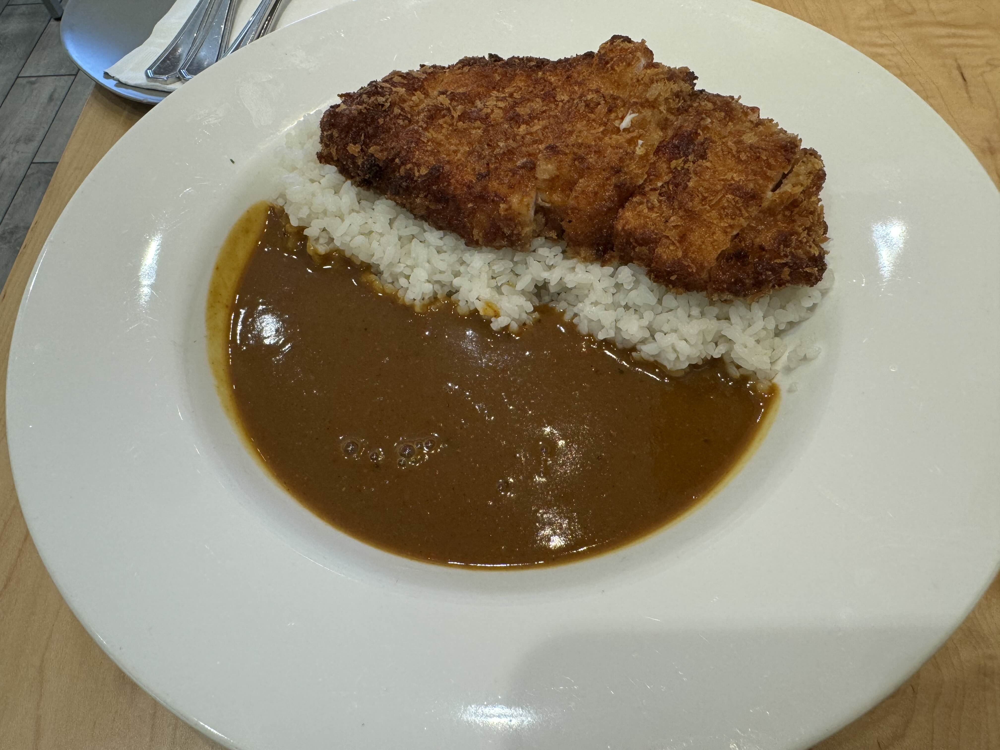
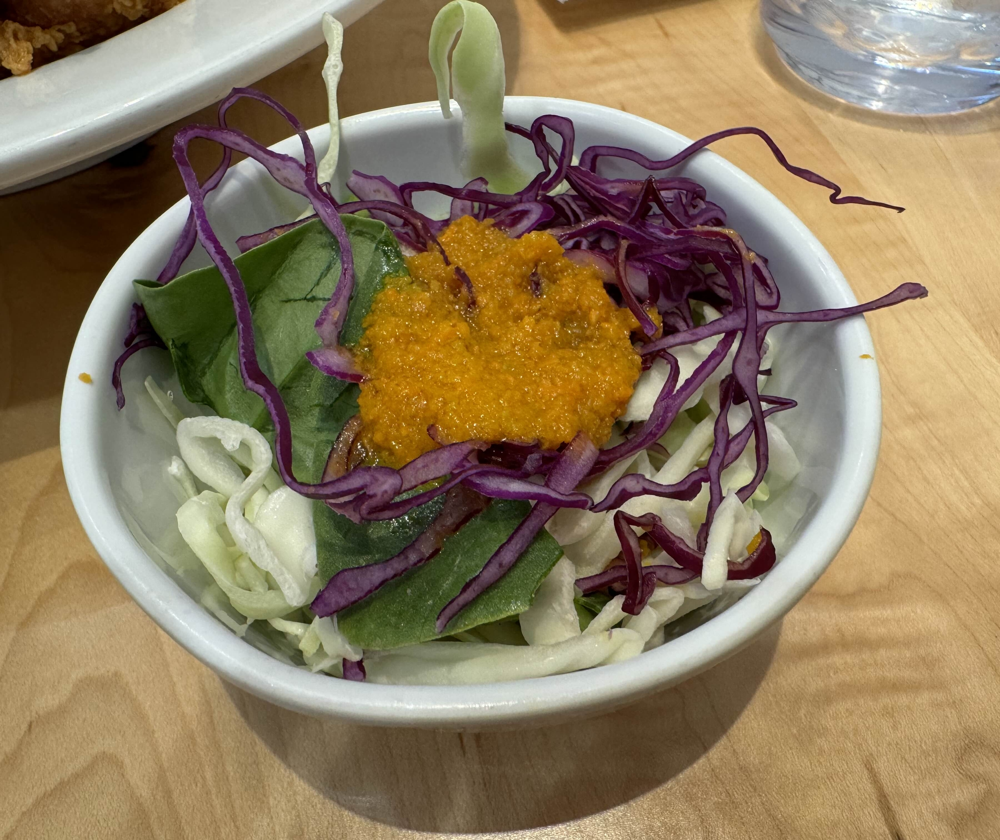

---	
title: Demiya Japanese Curry - De Anza
published: 2024-09-15	
description: A Japanese curry restuarant located within the DeAnza Shopping Center.
image: ..\..\assets\images\IMG_7918.jpg
tags: [Food, Review]	
category: 'Food Review'	
draft: false 	
lang: ''	
---	

Demiya is a Japanese curry restuarant located within the [DeAnza Shopping Center
](https://maps.app.goo.gl/aERs7CHd1ibrgpEK8) on South De Anza Boulevard. As I’ve been considering starting a blog to document my experiences and reviews, Demiya was the first restaurant I chose to visit.

On September 14th, 2024, a warm Saturday, my girlfriend and I decided to dine out at a Japanese curry restaurant which has been previously recommended to us. With the day being on a weekend, DeAnza plaza naturally was filled with families looking for food or activities and traffic in the parking lot was not any less crowded. Fortunately, we arrived a bit later than peak lunch time (1pm) and did not have to be put on any waitlist to be seated.

## The Food

Demiya offers a wide variety of curry dishes, from curry rice to curry udon to Teishoku (Japanese set meals). Since Japanese curry rice was what was recommended to me and the main reason I decided to pay a visit, my choice was the most basic yet popular option: Tonkatsu curry rice. On top of that, I have also ordered a small side salad to pretend that I am *healhtier* than I actually am. There are a few addon options on the curry rice and spice level was the only one I modified. With the spice level from 0 (no spice) to 3, my curry rice was only level 1.

The cost of the two items are as follow:

- Tonkatsu Curry Rice: $15.50
- Small Side Salad: $1.50

<!-- 
 -->

The tonkatsu curry rice arrived in around 10 to 15 minutes, with the pork still freshly fried. The pork cutlet slices were cleanly and fully cut, eliminating the need of a knife. Both the curry and the prok cutlets were pretty hot on arrival, which I instantly dug in.

The pork cutlets were well cooked, with a perfectly crunchy surface. The curry sauce had a great viscosity and was mixed well with the rice and pork. It also had a hint of sweetness but was overpowered more by the spiciness. Personally, I would have chosen 0 spice level instead next time as I prefer having more sweetness in Japanese curry.Although the spice-to-sweetness ratio was slightly off from my preference, which is due to my own choice at the time of ordering, the overall combination of curry and cutlet worked well and I quickly finished two-thirds of the plate. The portion of the Tonkatsu curry was quite large, making it difficult to finish the entire plate for me. Demiya does provide takeout boxes, which my girlfriend and I used to pack the remaining curry to take home.

The small salad side contained a mix of a few types of dried vegetables. I personally really like dried salad and with a small addition of caesar sauce, I finished the side with no problems.

## The Environment

The overall restaurant was clean with good lightning, no complaints there at all. Hand sanitizers are available on each table which was nice to have. Demiya also provides accommodation for smaller childrens with high chairs as I observed at a table nearby with their whole family. The only feedback I have is that there were some loud beeping sounds during the first half of our dining. Perhaps this is because we were seated closer to the opened kitchen and it could have affected us more, but I would have had an even more comfortable dining experience if that did not happen.

## Overall

Overall, Demiya is a really nice restaurant with great food at a pretty reasonable price. Considering the proportion and the pricing of other restaurants around the Bay Area, the meal was definitely worth it in my book. Despite the minor inconvenience from the noises, Demiya at DeAnza is a place I will be coming back to when I crave some Japanese curry.

## Rating

Overall Rating: 7.5/10 ⭐⭐⭐⭐⭐⭐⭐✨

### Location

Demiya - De Anza  
[1145 South De Anza Boulevard](https://www.google.com/maps/place/1145+S+De+Anza+Blvd,+San+Jose,+CA+95129/data=!4m2!3m1!1s0x808fb51ca2fa6515:0x6d11e31c1f2f95?sa=X&ved=1t:242&ictx=111)  
San Jose, CA 95129
